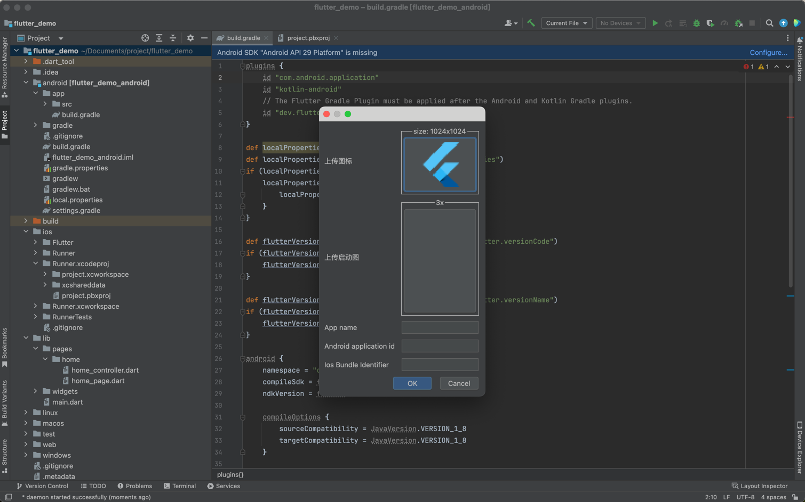

# Usage

## How to update appId、appName、icon、launchImage?
##### 1. Right click on package -> New -> Flutter Project Config

##### 2. Enter the content you want to modify. The LaunchImage uses a 3x image and the icon size is 1024 x 1024
##### 3. Click OK

## How to create widget?

##### 1. Right click on package -> New -> Flutter Widget

##### 2. Enter widget name

##### 3. Select widget type
##### 4. Click OK

## How to create page?

##### 1. Right click on package -> New -> Flutter Page

##### 2. Enter mvc name

##### 3. Select whether to use the go_router
##### 4. Click OK
